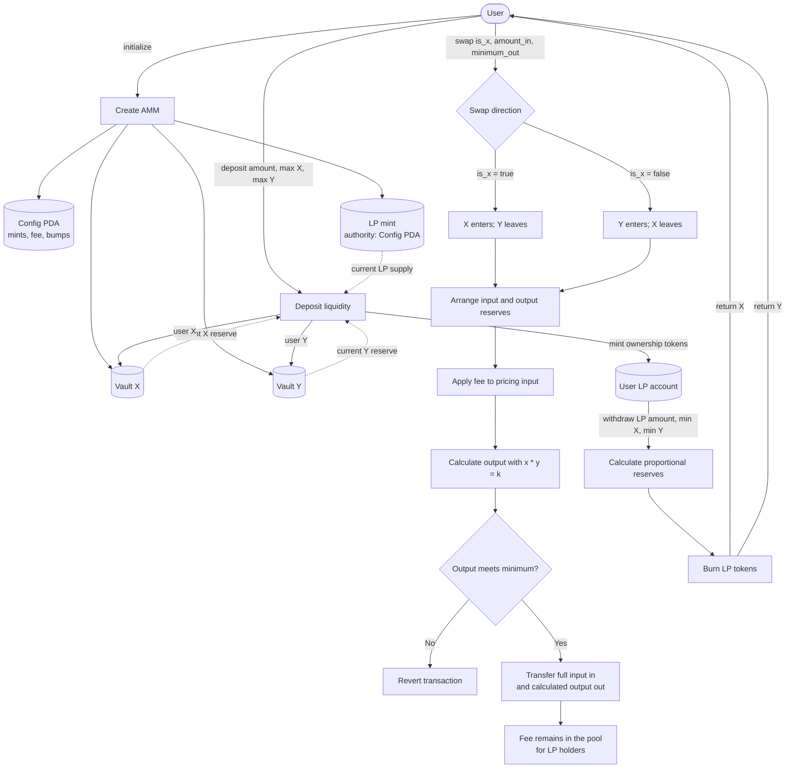
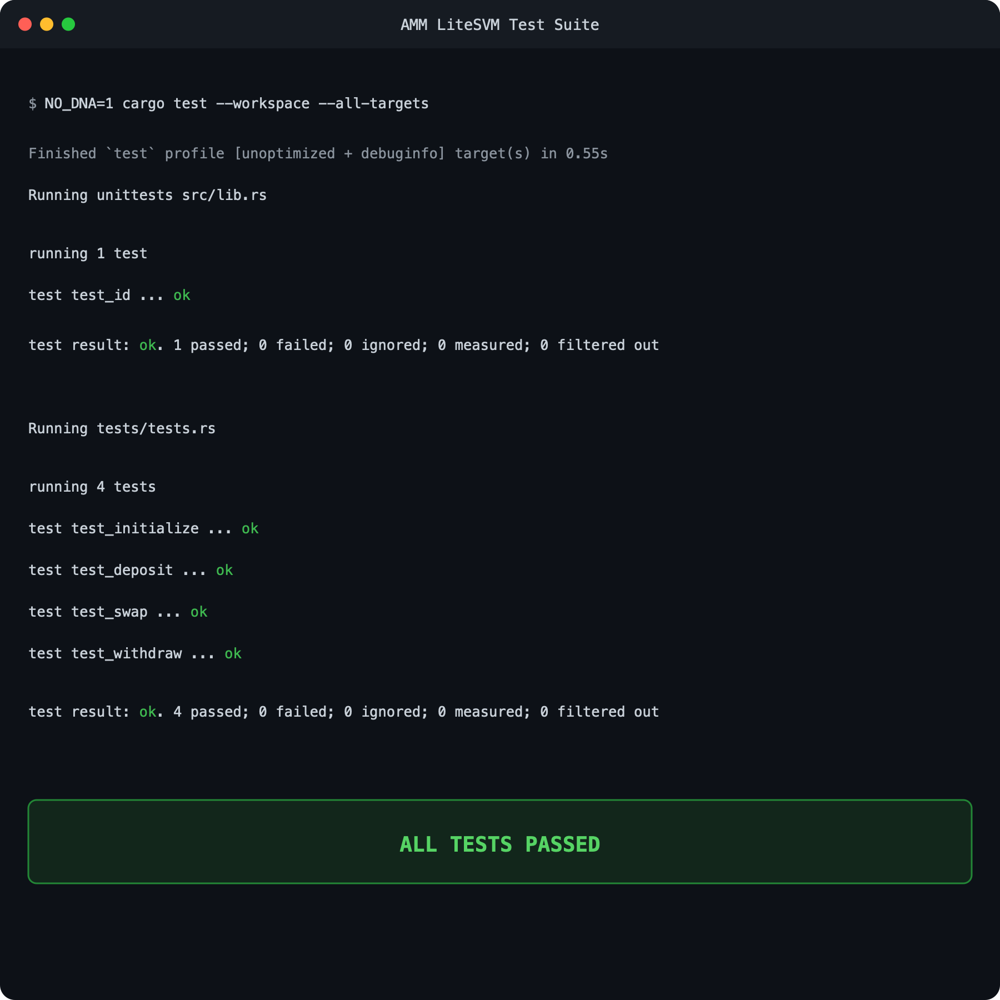

# Constant-Product AMM

An educational automated market maker built on Solana with Anchor. The program manages a two-token liquidity pool, issues LP tokens to liquidity providers, executes swaps using the constant-product invariant, and returns proportional reserves when LP tokens are redeemed.

## AMM model

The pool follows the constant-product invariant:

```text
x * y = k
```

- `x` is the token X balance in `vault_x`.
- `y` is the token Y balance in `vault_y`.
- `k` is the product of both reserves.

A swap adds one token to the pool and removes the other. The output is calculated so that the pool remains on its constant-product curve, subject to integer rounding and fees.

Swap fees use an LP-fee model. Only the fee-adjusted input determines the output, while the complete input amount is transferred into the input vault. The difference remains in the pool and increases the value represented by existing LP tokens. There is no separate treasury account in this implementation.

## Instructions

| Instruction | Purpose |
| --- | --- |
| `initialize` | Creates the config PDA, LP mint, and token X/Y vaults. |
| `deposit` | Transfers proportional X and Y liquidity into the vaults and mints LP tokens. |
| `swap` | Exchanges X for Y or Y for X using fee-adjusted constant-product pricing. |
| `withdraw` | Burns LP tokens and returns the corresponding share of both reserves. |

## Program flow



## Accounts

The `Config` PDA is derived from:

```text
["config", seed]
```

It records the two token mints, swap fee, authority, lock state, and PDA bumps. The LP mint is derived from:

```text
["lp", config]
```

The config PDA controls the LP mint and owns the associated token vaults, allowing the program to sign token transfers with deterministic PDA seeds.

## Build and test

The project uses Rust-based LiteSVM integration tests, so no external validator is required.

```bash
cargo build-sbf --manifest-path programs/amm-video/Cargo.toml
cargo test --workspace --all-targets
```

The test suite covers the happy path for every instruction:

- Pool initialization
- Liquidity deposit
- Fee-aware swap behavior
- Liquidity withdrawal

## Test result

All program and LiteSVM tests pass:



## Project structure

```text
programs/amm-video/
├── src/
│   ├── instructions/
│   │   ├── initialize.rs
│   │   ├── deposit.rs
│   │   ├── swap.rs
│   │   └── withdraw.rs
│   ├── error.rs
│   ├── lib.rs
│   └── state.rs
└── tests/
    ├── ix_handlers/
    └── tests.rs
```

## Program ID

```text
6KoUjko5kqLHaF31gdWGBihf8Pw8dUNte2hBpBEJveVe
```
